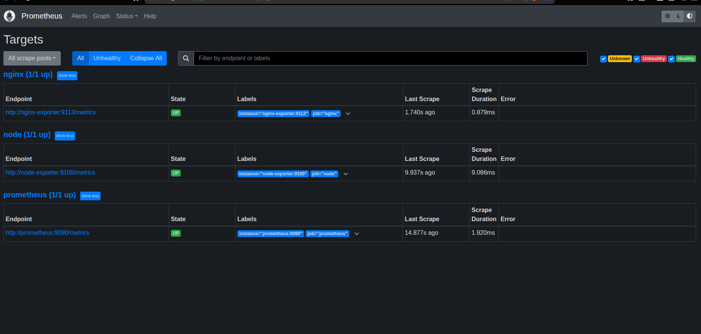
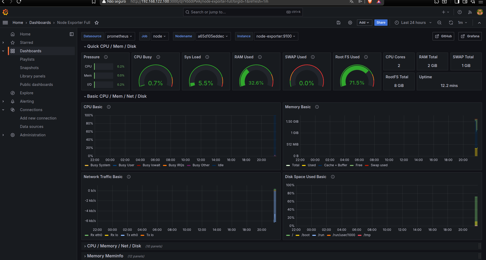

# 🖥️ Web Server Lab — Docker Edition

Servidor web containerizado com monitoramento completo, construído como projeto prático de aprendizado em DevOps.

A stack roda inteiramente via Docker Compose em uma VM Debian (QEMU/KVM), com Nginx servindo conteúdo estático, Prometheus coletando métricas do sistema e do servidor web, e Grafana exibindo dashboards em tempo real.

---

## 📌 Sobre o projeto

Este projeto simula um ambiente de servidor web próximo do que se encontra em produção:
servidor web funcional, observabilidade completa com métricas e um processo de backup automatizado — tudo containerizado e reproduzível com um único comando.

**Motivação:** transição de carreira para DevOps, com foco em infraestrutura, automação e observabilidade.

---

## 📸 Screenshots




---

## 🛠️ Stack de tecnologias

| Tecnologia | Versão | Função |
|---|---|---|
| Docker + Docker Compose | 24+ | Containerização e orquestração |
| Debian | 12 (Bookworm) | Sistema operacional da VM |
| QEMU/KVM | — | Virtualização do ambiente |
| Nginx | alpine | Servidor web |
| nginx-prometheus-exporter | 1.1.0 | Traduz métricas do Nginx para o Prometheus |
| Prometheus | 2.51.0 | Coleta e armazenamento de métricas |
| node_exporter | 1.7.0 | Métricas do sistema operacional |
| Grafana | 10.4.0 | Visualização de métricas em dashboard |

---

## 🏗️ Arquitetura

```
Host (Ubuntu)
└── VM Debian via QEMU/KVM (IP: <IP-DA-VM>)
    └── Docker (rede: lab-network)
        ├── nginx              :8080  → serve index.html
        ├── nginx-exporter     :9113  → traduz métricas do Nginx
        ├── node-exporter      :9100  → métricas do sistema (CPU, RAM, disco)
        ├── prometheus         :9090  → coleta /metrics dos exporters a cada 15s
        └── grafana            :3000  → visualiza dados do Prometheus
```

**Fluxo de dados:**

```
node-exporter  :9100  ──┐
nginx-exporter :9113  ──┼──► Prometheus armazena no TSDB
                        │
                        └──► Grafana consulta via PromQL e exibe dashboards
```

---

## 🚀 Como reproduzir

### 1. Instalar Docker na VM Debian

\`\`\`bash
curl -fsSL https://get.docker.com | sh
sudo usermod -aG docker $USER
\`\`\`

### 2. Clonar o repositório

\`\`\`bash
git clone https://github.com/douglas-dsantos/web-server-lab.git
cd web-server-lab
\`\`\`

### 3. Subir toda a stack

\`\`\`bash
docker compose up -d
\`\`\`

### 4. Verificar se está tudo rodando

\`\`\`bash
docker compose ps
\`\`\`

### 5. Acessar os serviços

### 5. Acessar os serviços

| Serviço    | Endereço                  | Credenciais   |
|------------|---------------------------|---------------|
| Nginx      | `http://SEU-IP:8080`      | —             |
| Prometheus | `http://SEU-IP:9090`      | —             |
| Grafana    | `http://SEU-IP:3000`      | admin / admin |

> **Nota:** substitua `SEU-IP` pelo IP da sua VM. Use `ip a` dentro da VM para descobrir.

### 6. Importar dashboard no Grafana

1. Acesse o Grafana
2. Dashboards → Import
3. ID: **1860** → Load
4. Selecione datasource **Prometheus** → Import

---

## 📊 O que é monitorado

- **CPU** — uso por core, load average, I/O wait
- **Memória** — RAM usada, cache, swap
- **Disco** — espaço usado por partição, I/O
- **Rede** — tráfego de entrada e saída
- **Nginx** — conexões ativas, requisições por segundo
- **Uptime** — tempo online do servidor

---

## ⚙️ Comandos úteis

\`\`\`bash
# Subir a stack
docker compose up -d

# Ver logs em tempo real
docker compose logs -f nginx

# Ver status dos containers
docker compose ps

# Derrubar a stack
docker compose down

# Derrubar e apagar volumes
docker compose down -v
\`\`\`

---

## 📁 Estrutura do repositório

\`\`\`
web-server-lab/
├── docker-compose.yml
├── nginx/
│   ├── Dockerfile
│   ├── nginx.conf
│   └── index.html
├── prometheus/
│   └── prometheus.yml
├── grafana/
│   └── provisioning/
│       └── datasources/
│           └── prometheus.yml
└── docs/
    ├── grafana-dashboard.png
    └── prometheus-targets.png
\`\`\`

---

## 🧠 O que aprendi

**Conceito mais importante:** a diferença entre instalar um serviço diretamente no sistema operacional e containerizá-lo. Com Docker Compose, toda a stack sobe com um único comando e cada serviço fica isolado no seu container, se comunicando pelo nome do container como hostname dentro da rede Docker.

**Erro que mais ensinou:** configurar o datasource do Grafana apontando para localhost faz o Grafana tentar acessar o Prometheus dentro do próprio container. O endereço correto é o nome do container (http://prometheus:9090), que o Docker resolve automaticamente pela rede interna.

---

## 🗺️ Próximos passos

- [ ] Adicionar HTTPS com certificado auto-assinado no Nginx
- [ ] Configurar alertas no Grafana (CPU > 80%, disco > 90%)
- [ ] Centralizar logs com Loki + Promtail
- [ ] Criar pipeline CI/CD com GitHub Actions
- [ ] Provisionar infraestrutura com Terraform

---

## 📚 Referências

- [Documentação oficial do Nginx](https://nginx.org/en/docs/)
- [Prometheus Getting Started](https://prometheus.io/docs/prometheus/latest/getting_started/)
- [Grafana Docs](https://grafana.com/docs/)
- [Node Exporter Full Dashboard](https://grafana.com/grafana/dashboards/1860)

---

*Projeto desenvolvido como parte do processo de transição de carreira para DevOps.*
